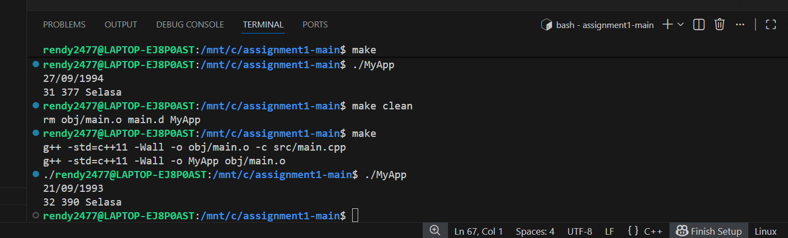

# Laporan Programming Assignment 1: Basic C++

## 1. Hasil Program (Screenshot)

## 2. Logika Sederhana
- **yearsOld**: "Menghitung selisih tahun antara waktu sistem dan input user, dengan pengecekan apakah sudah melewati hari ulang tahun atau belum."

- **monthsOld**: "Mengonversi seluruh masa hidup ke dalam satuan bulan."

- **dayOfDate**: "Menggunakan fungsi `mktime` untuk mendapatkan index hari (0-6) dan mengubahnya menjadi nama hari dalam bahasa Indonesia."

## 3. Kesimpulan
- "Berhasil mengimplementasikan library `<ctime>` untuk pengolahan waktu."
- "Memahami cara kerja `struct tm` dan manipulasi tanggal di C++."